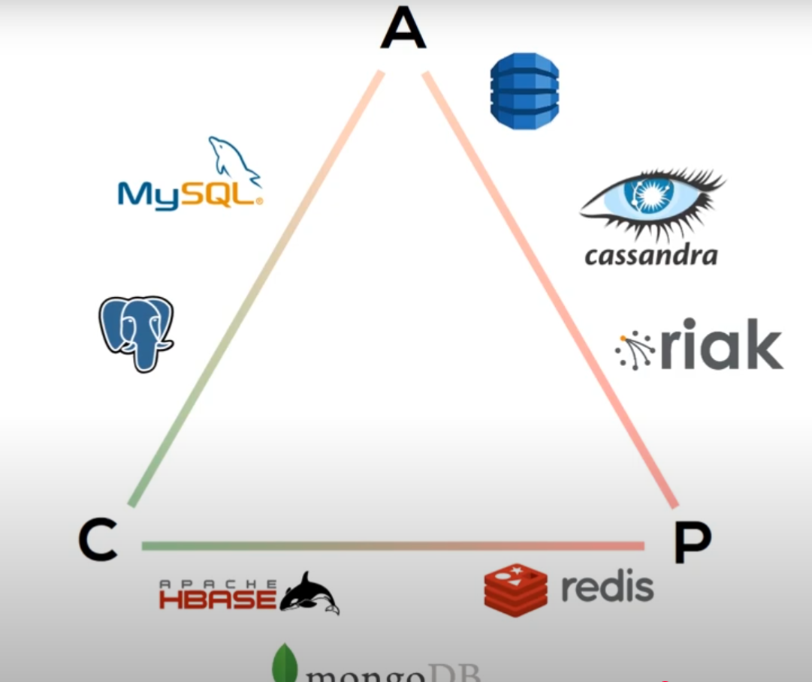

# What is Cassandra?
Apache Cassandra is an open-source NoSQL database that is used for handling big data. Apache Cassandra has the capability 
to handle structured, semi-structured and unstructured data. It was originally developed at Facebook and in 2008 its 
was open-sourced.  
The Apache Cassandra database is the right choice when you need scalability and high availbility without compromising 
performance. Cassandra support for replicating across multiple datacenters, providing lower latency.

Fault-tolerance - Data is automatically replicated to multiple nodes for fault-tolerance. Replication across multiple 
data centers is supported. Failed nodes can be replaced with no downtime. 

Decentralized - there are no single point of failure. There is no network bottlenecks. Every node in the cluster is 
identical.

Scalable - Some of the largest production deployments include Apple's with over 75,000 nodes storing over 10 PB of data, 
Netflix (2,500 nodes, 420 TB of data, over 1 trillion requests per day.)

Durable - Cassandra is suitable for applications that can't affors to lose data, even when an entire data center goes 
down.

Elastic - Read and write throughput both increases linearly as new machines are added, with no downtime or interruption 
to applications. 

#The CAP Theorm 
CAP stands for Consistency, Availability and Partition Tolerant, Apache Cassandra falls under AP (Availability and 
Partition Tolerant) but not Consistency. But this can further tuned via replication factor (how many copies of data) and 
consistency level (read and write).

##Consistency
In CAP theorem, consistency is the property of a distributed system that ensures all nodes have the same 
data at any given point of time. 

##Availability
In the CAP theorem, "Availability" refers to the guarantee that a distributed system will always respond to a client 
request with a non-error response, even if some nodes are down or unavailable, meaning that every working node in the 
system will return a valid response to any request, regardless of potential failures; essentially prioritizing system 
uptime over completely consistent data.

##Partition Tolerance 
In the CAP theorem, "fault tolerance" is essentially synonymous with "partition tolerance," meaning a distributed 
system's ability to continue functioning even when network partitions occur, where parts of the system can't communicate 
with each other; it's considered the most crucial aspect of the CAP theorem, as it ensures the system remains operational 
despite network failures or communication breakdowns between nodes.

#Let's understand where Apache Cassandra fits in CAP theorem.

#Installing Apache Cassandra

